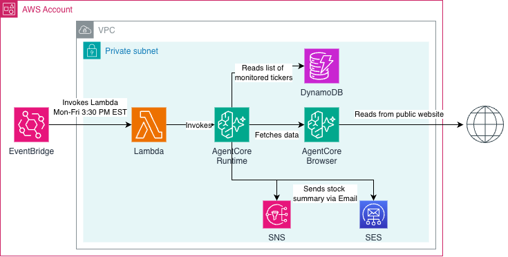
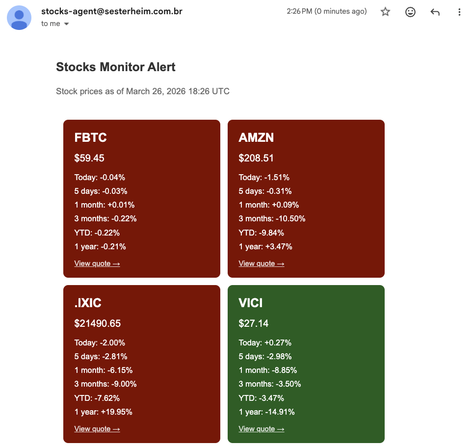
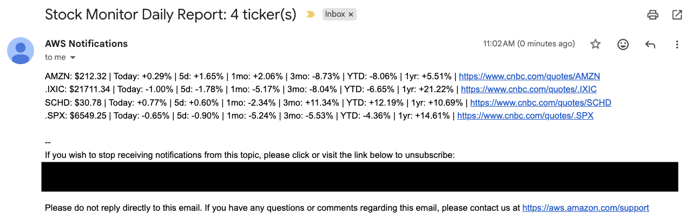

# Stocks Monitor Agent

A daily stock market monitor that sends email notifications with price and performance data for a configurable list of tickers. Built on AWS AgentCore Runtime using Python, Bedrock (Claude), and Playwright.

- [Architecture](#architecture)
- [How to run](#how-to-run)
- [Disclaimers](#disclaimers)
- [Troubleshooting](#troubleshooting)

---

## Architecture



### Component responsibilities

| Component | Responsibility |
|---|---|
| EventBridge Scheduler | Invokes the Lambda function Mon–Fri at 3:30 PM EST |
| Lambda | Invokes the AgentCore Runtime session |
| AgentCore Runtime | Hosts the Python agent container |
| DynamoDB | Stores the list of tickers to monitor |
| AgentCore Browser | Fetches quote pages from internet |
| Bedrock (Amazon Nova Micro) | Extracts structured market data from page text |
| SES / SNS | Delivers the daily email report |
| ECR | Stores the agent and lambda invoker container images |
| S3 | Stores Terraform remote state |

---

## How to run

### Prerequisites

- AWS CLI configured with sufficient permissions
- Terraform >= 1.5
- Docker with `buildx` support
- `jq` installed

### 1. Bootstrap Terraform state bucket

```bash
AWS_ACCOUNT_ID=$(aws sts get-caller-identity --query Account --output text)

aws cloudformation deploy \
  --template-file cloudformation/terraform-state-bucket.yaml \
  --stack-name terraform-state-bootstrap \
  --parameter-overrides BucketName="${AWS_ACCOUNT_ID}-stocks-monitor-state-files"
```

### 2. Configure variables

```bash
cp terraform/terraform.tfvars.example terraform/terraform.tfvars
# Edit terraform/terraform.tfvars with your values
```

### 3. Initialize Terraform and create ECR repositories

```bash
terraform -chdir=terraform init \
  -backend-config="bucket=${AWS_ACCOUNT_ID}-stocks-monitor-state-files" \
  -backend-config="region=us-east-1"

terraform -chdir=terraform apply \
  -var-file="terraform.tfvars" \
  -target="module.ecr"
```

### 4. Build and push the agent image

```bash
VERSION="1"
ECR_AGENT_URL=$(terraform -chdir=terraform output -raw ecr_repository_url)

aws ecr get-login-password --region us-east-1 \
  | docker login --username AWS --password-stdin "$ECR_AGENT_URL"

docker buildx build \
  --platform linux/arm64 \
  --provenance=false \
  --output type=image,name="${ECR_AGENT_URL}:v${VERSION}",push=true \
  stocks_monitor_agent/
```

### 5. Build and push the Lambda invoker image

```bash
VERSION="1"
ECR_LAMBDA_URL=$(terraform -chdir=terraform output -raw lambda_invoker_ecr_repository_url)

aws ecr get-login-password --region us-east-1 \
  | docker login --username AWS --password-stdin "$ECR_LAMBDA_URL"

docker buildx build \
  --platform linux/arm64 \
  --provenance=false \
  --output type=image,name="${ECR_LAMBDA_URL}:v${VERSION}",push=true \
  lambda_invoker/
```

### 6. Deploy all remaining infrastructure

```bash
terraform -chdir=terraform apply \
  -var-file="terraform.tfvars" \
  -var="lambda_invoker_image_uri=${AWS_ACCOUNT_ID}.dkr.ecr.us-east-1.amazonaws.com/stocks-monitor-lambda-invoker:v${VERSION}" \
  -var="container_image_uri=${AWS_ACCOUNT_ID}.dkr.ecr.us-east-1.amazonaws.com/stocks-monitor-agent:v${VERSION}"
```

### 7. Set CloudWatch log retention (optional)

If you intend to run the solution for a long while, make sure you update the CloudWatch Log groups retention policy to avoid expenses with storage. These log groups are auto-created by AWS and cannot be managed by Terraform. Run once after the AgentCore Runtime and Lambda are deployed. Update the log group names to match your deployed resources.

```bash
aws logs put-retention-policy \
  --region us-east-1 \
  --log-group-name "/aws/lambda/stocks-monitor-lambda-invoker" \
  --retention-in-days 7

aws logs put-retention-policy \
  --region us-east-1 \
  --log-group-name "/aws/bedrock-agentcore/runtimes/StocksMonitorRuntime-LRCtNuEcNB-DEFAULT" \
  --retention-in-days 7
```

## Done!

By this point you're going to receive the emails every business day at 3:30PM with the configured stocks information. This is the notification you can expect once the agent runs:

- With SES:



- With SNS:



---

## Disclaimers

### Educational project

This project is intended for **educational and learning purposes only**. It is not production-ready and should not be used to make financial decisions or run in a production environment without significant hardening, testing, and review.

### AWS Costs

This is a project that will use AWS resources in your account, and therefore will generate costs. To clean up the resources, use the command below:

```bash
terraform -chdir=terraform destroy -var-file="terraform.tfvars"
```

All the created AWS resources will be destroyed with this command, except for the S3 bucket that holds the state file. This bucket has to be deleted via the AWS console or CLI.


### Terraform best practices

The Terraform code in this repository follows a simplified single-repo structure suitable for a small project. For larger teams or multi-environment setups, consider the code organization patterns recommended [in this article](https://guisester.substack.com/p/terraform-code-organization-best-practices-ef43d32eedb1).

---

## Troubleshooting 

### 1. Invoke manually (optional)

```bash
PAYLOAD=$(echo -n '{"prompt": "run"}' | base64)
RUNTIME_ARN=$(terraform -chdir=terraform output -raw agentcore_runtime_arn)

aws bedrock-agentcore invoke-agent-runtime \
  --region us-east-1 \
  --agent-runtime-arn "$RUNTIME_ARN" \
  --runtime-session-id "$(uuidgen)" \
  --content-type "application/json" \
  --accept "application/json" \
  --payload "$PAYLOAD" \
  output.bin
```

> **Tip:** AgentCore Runtime uses session-based containers. The first invocation with a new session ID starts a cold container. Reusing the same session ID on a second call hits the warm container immediately.

### 2. Local debug (optional)

Run the agent container locally with your AWS session credentials, then invoke it from another terminal.

```bash
ECR_AGENT_URL=$(terraform -chdir=terraform output -raw ecr_repository_url)
SNS_TOPIC_ARN=$(terraform -chdir=terraform output -raw sns_topic_arn)

docker run -p 8080:8080 \
  -e AWS_ACCESS_KEY_ID="<your-key>" \
  -e AWS_SECRET_ACCESS_KEY="<your-secret>" \
  -e AWS_SESSION_TOKEN="<your-token>" \
  -e AWS_DEFAULT_REGION="us-east-1" \
  -e AWS_REGION_NAME="us-east-1" \
  -e STOCKS_TABLE_NAME="<your-table-name>" \
  -e SNS_TOPIC_ARN="$SNS_TOPIC_ARN" \
  -e RECIPIENT_EMAIL_ADDRESSES='["your@email.com"]' \
  -e CLAUDE_MODEL_ID="amazon.nova-micro-v1:0" \
  -e USE_SES="false" \
  "${ECR_AGENT_URL}:v${VERSION}"
```

```bash
# In another terminal
curl -X POST http://localhost:8080/invocations \
  -H "Content-Type: application/json" \
  -d '{"prompt":"run"}'
```
